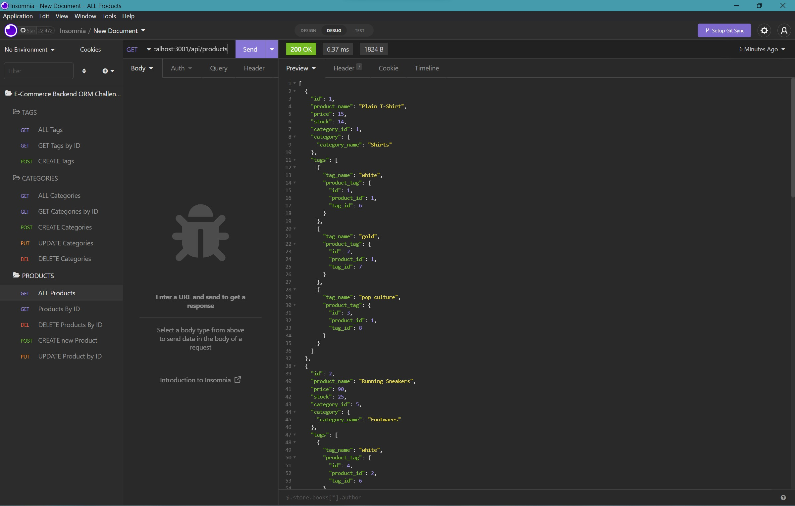

# Project Title [ E-Commerce-BackEnd-Object-Relational-Mapping ]

Walk-Through Video INSOMNIA: 

-----

## Table of Contents
1. [Description](#description)
2. [Installation](#installation)
3. [Usage](#usage)
4. [Contributing](#contributing)
5. [Tests](#tests)
6. [License](#license)
7. [Questions](#questions)

-----

### Description 
Built the back end for an e-commerce site, using Sequelize to interact with a MySQL database.

-----

### Installation Req
Sequelize, MySQL2, Dotevn, Express, NPM, NODE

-----

### Usage 
User Story
AS A manager at an internet retail company
I WANT a back end for my e-commerce website that uses the latest technologies
SO THAT my company can compete with other e-commerce companies

Acceptance Criteria
GIVEN a functional Express.js API
WHEN I add my database name, MySQL username, and MySQL password to an environment variable file
THEN I am able to connect to a database using Sequelize
WHEN I enter schema and seed commands
THEN a development database is created and is seeded with test data
WHEN I enter the command to invoke the application
THEN my server is started and the Sequelize models are synced to the MySQL database
WHEN I open API GET routes in Insomnia Core for categories, products, or tags
THEN the data for each of these routes is displayed in a formatted JSON
WHEN I test API POST, PUT, and DELETE routes in Insomnia Core
THEN I am able to successfully create, update, and delete data in my database

-----

### Contributing 
YES 

-----

### Tests 
Insomnia

-----

### License 
MIT 

-----

### Questions 

#### GitHub Username: min-hinthar 

#### GitHub URL: https://github.com/min-hinthar

#### GitHub Repo: https://github.com/min-hinthar/E-Commerce-BackEnd-Object-Relational-Mapping

#### Email: min@hintharinc.com

-----
